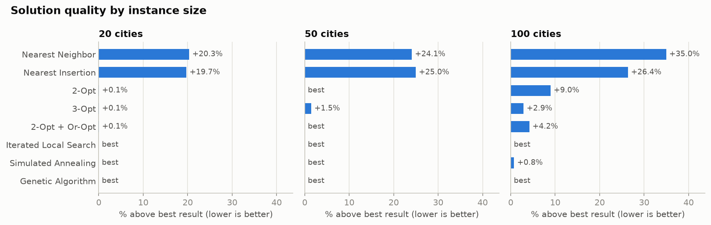
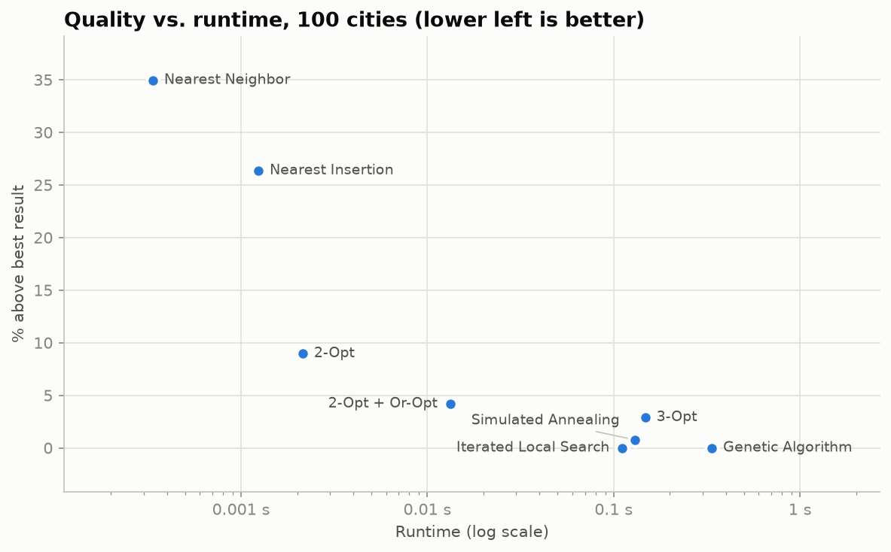
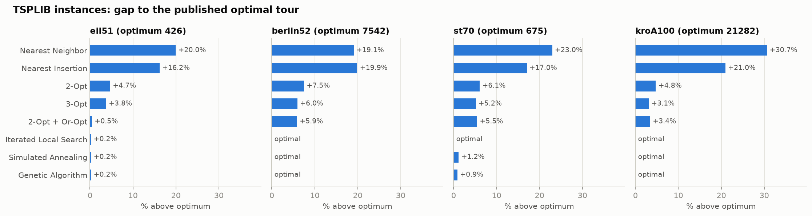
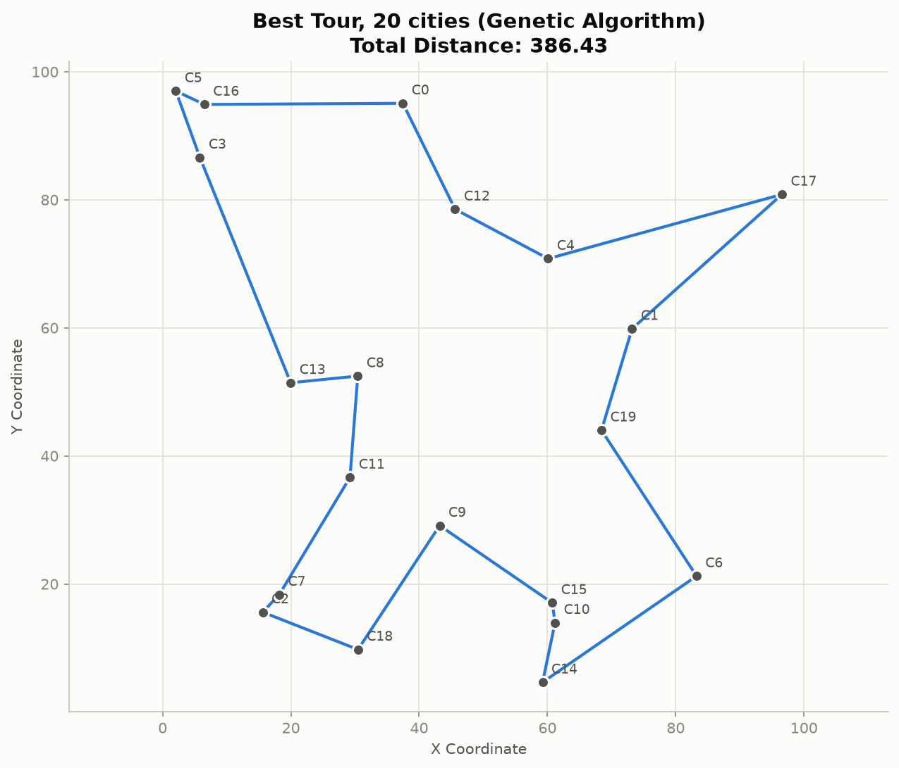
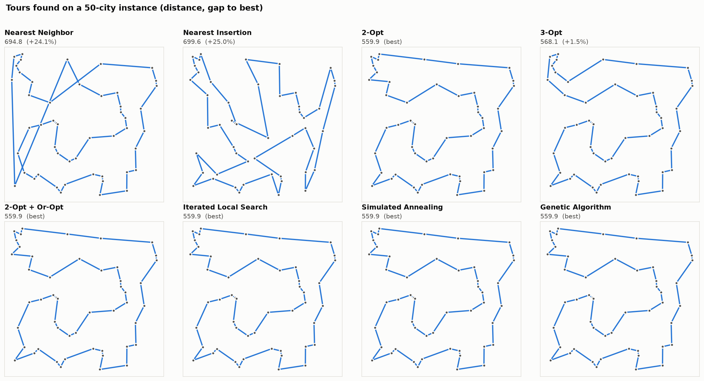

# Traveling Salesman Problem Solver

[](https://www.python.org/downloads/)
[](LICENSE)
[](#algorithms)
[](https://github.com/efkopru/traveling-salesman/actions/workflows/tests.yml)

A Python implementation of exact, constructive, local-search and metaheuristic algorithms for the Traveling Salesman Problem (TSP), with TSPLIB support, a command-line interface and reproducible benchmarks.

## Algorithms

| Algorithm | Type | Time Complexity | Strengths |
|-----------|------|----------------|-----------|
| **Brute Force** | Exact | O(n!) | Guaranteed optimum; feasible for n ≤ 10 |
| **Held-Karp** | Exact (dynamic programming) | O(n²·2ⁿ) | Guaranteed optimum up to 20 cities (≈1.7 s) |
| **Nearest Neighbor** | Greedy | O(n²) | Very fast, simple |
| **Nearest Insertion** | Constructive | O(n²) | Fast, similar quality to Nearest Neighbor |
| **2-Opt** | Local Search | O(n²) per pass, usually far less | Large improvement in milliseconds; 1000 cities in under a second |
| **3-Opt** | Local Search | O(n³) per pass | Escapes some 2-opt local optima |
| **Or-Opt** | Local Search | O(n·k) per pass | Moves segments of 1–3 cities |
| **2-Opt + Or-Opt** | Local Search | — | Both, alternated until neither improves |
| **Iterated Local Search** | Metaheuristic | O(iterations · n) | Double-bridge kicks + 2-opt; best quality per second |
| **Simulated Annealing** | Metaheuristic | O(iterations) | Escapes local optima; temperatures calibrated on its own moves |
| **Genetic Algorithm** | Memetic (GA + 2-opt) | O(gen · pop · local search) | Best result, or within 1% of it, on every benchmark below |

How the local search stays fast:
- Every move is evaluated in O(1) from the distance matrix, without recomputing the tour.
- 2-Opt scans each city's partners in order of distance and stops as soon as no improving move is possible. With the default (all cities as partners) the result is still a true 2-opt local optimum.
- "Don't-look bits" skip cities whose surroundings have not changed.

## Performance Results

### Random instances

Random uniform instances in a 100×100 square, `generate_random_cities(n)` with the default seed and `TSPSolver(..., seed=42)`. Percentages are relative to the best result in each column (bold). For 20 cities the best result, 386.43, is the proven optimum (Held-Karp). Times are the fastest of 3 runs and vary by machine.

| Algorithm | 20 cities | 50 cities | 100 cities | Time at 100 cities (s) |
|-----------|-----------|-----------|------------|------------------------|
| Nearest Neighbor | 465.04 (+20.3%) | 694.76 (+24.1%) | 1006.40 (+35.0%) | 0.0003 |
| Nearest Insertion | 462.66 (+19.7%) | 699.63 (+25.0%) | 942.29 (+26.4%) | 0.0012 |
| 2-Opt | 386.63 (+0.1%) | **559.86** | 812.63 (+9.0%) | 0.0021 |
| 3-Opt | 386.63 (+0.1%) | 568.11 (+1.5%) | 767.35 (+2.9%) | 0.15 |
| 2-Opt + Or-Opt | 386.63 (+0.1%) | **559.86** | 777.00 (+4.2%) | 0.013 |
| Iterated Local Search | **386.43** | **559.86** | **745.73** | 0.11 |
| Simulated Annealing | **386.43** | **559.86** | 751.40 (+0.8%) | 0.13 |
| Genetic Algorithm | **386.43** | **559.86** | **745.73** | 0.34 |





### TSPLIB instances (gap to the published optimum)

Four classic instances from [TSPLIB](http://comopt.ifi.uni-heidelberg.de/software/TSPLIB95/) are bundled in [`data/tsplib`](data/tsplib). Distances use TSPLIB's rounding convention, so lengths are directly comparable with the published optima. Bold means optimal.

| Algorithm | eil51 (426) | berlin52 (7542) | st70 (675) | kroA100 (21282) |
|-----------|-----------|-----------|-----------|-----------|
| Nearest Neighbor | 511 (+20.0%) | 8980 (+19.1%) | 830 (+23.0%) | 27807 (+30.7%) |
| Nearest Insertion | 495 (+16.2%) | 9043 (+19.9%) | 790 (+17.0%) | 25742 (+21.0%) |
| 2-Opt | 446 (+4.7%) | 8108 (+7.5%) | 716 (+6.1%) | 22294 (+4.8%) |
| 3-Opt | 442 (+3.8%) | 7991 (+6.0%) | 710 (+5.2%) | 21942 (+3.1%) |
| 2-Opt + Or-Opt | 428 (+0.5%) | 7986 (+5.9%) | 712 (+5.5%) | 22013 (+3.4%) |
| Iterated Local Search | 427 (+0.2%) | **7542** | **675** | **21282** |
| Simulated Annealing | 427 (+0.2%) | **7542** | 683 (+1.2%) | **21282** |
| Genetic Algorithm | 427 (+0.2%) | **7542** | 681 (+0.9%) | **21282** |



### Larger instances

Tour length and runtime on random instances (same generator):

| Algorithm | 200 cities | 500 cities | 1000 cities |
|-----------|-----------|-----------|-----------|
| 2-Opt | 1094.3 (0.01 s) | 1743.3 (0.06 s) | 2434.2 (0.44 s) |
| 2-Opt + Or-Opt | 1078.2 (0.03 s) | 1709.7 (0.13 s) | 2361.5 (0.35 s) |
| Iterated Local Search | 1056.8 (0.22 s) | 1655.8 (0.84 s) | 2343.4 (1.83 s) |

## Installation

```
pip install -e .            # core solver (NumPy only)
pip install -e ".[all]"     # + matplotlib (plots) and pandas (benchmarks)
pip install -e ".[dev]"     # + pytest, for development
```

## Quick Start

```python
from tsp_solver import TSPSolver, generate_random_cities

# Generate random cities
cities = generate_random_cities(50)

# Create solver (seed makes the randomized algorithms reproducible)
solver = TSPSolver(cities, seed=42)

# Fast high-quality solution
tour, distance = solver.two_opt()
print(f"2-Opt distance: {distance:.2f}")

# Best quality per second
tour, distance = solver.iterated_local_search()
print(f"Iterated local search distance: {distance:.2f}")

# Visualize the tour (needs matplotlib)
solver.visualize_tour(tour, "Optimized Tour")
```

## Command Line

Installing the package adds a `tsp-solver` command (also available as `python -m tsp_solver`).

```
tsp-solver solve data/tsplib/berlin52.tsp                 # TSPLIB file
tsp-solver solve cities.csv -a 2-opt -a genetic_algorithm  # CSV: x,y[,name] per row
tsp-solver solve --random 200 --seed 1 --plot tour.png --tour-out tour.txt
tsp-solver demo                                            # the 20-city example below
```

Repeat `-a` to compare algorithms. The default algorithm is `iterated_local_search`. Choices: `brute_force`, `held_karp`, `nearest_neighbor`, `nearest_insertion`, `2-opt`, `3-opt`, `2-opt+or-opt`, `iterated_local_search`, `simulated_annealing`, `genetic_algorithm`. CSV files may have a header row; the optional third column names the cities.

```
$ tsp-solver solve data/tsplib/berlin52.tsp -a 2-opt -a genetic_algorithm --seed 42
Instance: berlin52 (52 cities, EUC_2D), optimum 7542
Algorithm                     Distance       Gap    Time (s)
2-opt                          8108.00     7.50%      0.0013
genetic_algorithm              7542.00     0.00%      0.2070

Best: genetic_algorithm, distance 7542.00
Tour: 6 -> 4 -> 25 -> 12 -> 28 -> 27 -> 26 -> 47 -> ... -> 6
```

## Example Output

Running `python -m tsp_solver demo`:

```
============================================================
TRAVELING SALESMAN PROBLEM - 20 Cities
============================================================

Algorithm Comparison:
------------------------------------------------------------
Algorithm              Distance        Time (s)
------------------------------------------------------------
nearest_neighbor       465.04          0.0001
nearest_insertion      462.66          0.0001
2-opt                  386.63          0.0003
3-opt                  386.63          0.0016
2-opt+or-opt           386.63          0.0013
iterated_local_search  386.43          0.0429
simulated_annealing    386.43          0.1289
genetic_algorithm      386.43          0.1057
held_karp              386.43          1.8919
------------------------------------------------------------

Best Solution: genetic_algorithm
Tour: C1 -> C19 -> C6 -> C14 -> C10 -> ...
Total Distance: 386.43

============================================================
ADDITIONAL ANALYSIS
============================================================

Small Instance (8 cities) - Exact vs Heuristic:
Exact Solution: 277.23
Heuristic Solution: 277.23
Gap: 0.00%
```

Best tour for the 20-city instance, drawn with `solver.visualize_tour`:



The tour each algorithm finds on the 50-city instance. Crossing edges are a visible sign of a non-optimal tour; 2-Opt removes all of them.



### Regenerating the figures

All images and the results tables above come from one script:

```
python scripts/generate_figures.py
```

Distances are deterministic; times depend on the machine.

## Usage Examples

### Basic Usage

```python
import numpy as np
from tsp_solver import TSPSolver

# Define city coordinates
cities = np.array([
    [60, 200], [180, 200], [80, 180], [140, 180],
    [20, 160], [100, 160], [200, 160], [140, 140]
])

solver = TSPSolver(cities)

# Fast approximation
tour_nn, dist_nn = solver.nearest_neighbor()

# Improve an existing tour
tour_2opt, dist_2opt = solver.two_opt(tour_nn)
tour_ls, dist_ls = solver.local_search(tour_2opt)    # 2-Opt + Or-Opt

# Optimal solution for small instances
tour_exact, dist_exact = solver.held_karp()           # up to 20 cities
```

### TSPLIB files

```python
from tsp_solver import TSPSolver, load_tsplib

solver = TSPSolver.from_tsplib("data/tsplib/kroA100.tsp", seed=42)
tour, distance = solver.genetic_algorithm()
print(distance, load_tsplib("data/tsplib/kroA100.tsp")["optimum"])   # 21282.0 21282
```

`EUC_2D`, `CEIL_2D` and `ATT` distance types are supported. Pass `distance="EUC_2D"` (or another TSPLIB convention) to `TSPSolver` to use the rounded distances directly.

### Algorithm Comparison

```python
results = solver.compare_algorithms([
    'nearest_neighbor',
    '2-opt',
    '2-opt+or-opt',
    'iterated_local_search',
    'simulated_annealing',
    'genetic_algorithm',
])

for algo, data in results.items():
    print(f"{algo}: Distance={data['distance']:.2f}, Time={data['time']:.4f}s")
```

- **Errors:** unknown algorithm names raise `ValueError`.
- **Size limits:** exact algorithms are skipped above their limit (brute force 10 cities, Held-Karp 20).
- **Seeding:** with a seed, every algorithm starts from the same random stream, so its result does not depend on which algorithms ran before it.

### Benchmarks with pandas

```python
import glob
from tsp_solver import TSPBenchmark

df = TSPBenchmark.run_tsplib_benchmark(sorted(glob.glob("data/tsplib/*.tsp")),
                                       ["2-opt", "iterated_local_search"], seed=42)
print(df[["Instance", "Algorithm", "Distance", "Optimum", "Gap (%)"]])
```

### Tuning

```python
solver.two_opt(neighbors=10)                    # only the 10 nearest cities as partners: faster on large instances
solver.iterated_local_search(iterations=5000)   # more kicks, better tours
solver.simulated_annealing(max_iterations=500000)
solver.genetic_algorithm(population_size=50, generations=200)
solver.held_karp(max_cities=22)                 # memory grows as n * 2^n
```

### Saving a plot without displaying it

```python
solver.visualize_tour(tour, "Tour", save_path="tour.png", show=False)
```

## Project Structure

```
src/tsp_solver/solver.py      TSPSolver: all algorithms, distances, plotting
src/tsp_solver/tsplib.py      TSPLIB reader and known optima
src/tsp_solver/benchmark.py   Benchmark helpers (pandas)
src/tsp_solver/cli.py         Command-line interface
src/tsp_solver/demo.py        The example comparison (tsp-solver demo)
data/tsplib/                  Bundled TSPLIB instances
tests/                        pytest suite
scripts/generate_figures.py   Regenerates images/ and the results tables
images/                       README figures
```

## Running Tests

```
pip install -e ".[dev]"
pytest
```

## Algorithm Selection Guide

### When to Use Each Algorithm

**Held-Karp / Brute Force**
- Guaranteed optimum: Held-Karp up to 20 cities, brute force up to 10

**Nearest Neighbor / Nearest Insertion**
- Need instant results
- Starting tour for local search

**2-Opt / 2-Opt + Or-Opt**
- Good tours in milliseconds; scale to thousands of cities
- Real-time applications

**Iterated Local Search**
- Default choice when a fraction of a second is acceptable
- Optimal on 3 of the 4 TSPLIB instances above, +0.2% on the fourth

**Genetic Algorithm**
- Best result, or within 1% of it, on every benchmark above, at about 3× the time of ILS

**Simulated Annealing**
- Escapes local optima; matched or beat 2-Opt on every instance tested, close behind ILS and the GA

**3-Opt**
- Included for comparison; 2-Opt + Or-Opt gives similar quality much faster


## Real-World Applications

This TSP solver can be applied to various optimization problems:

- **Logistics and Delivery**: Optimize delivery routes to minimize fuel costs
- **Manufacturing**: Minimize tool path length in CNC machining
- **Circuit Board Design**: Optimize component placement and routing
- **DNA Sequencing**: Find optimal sequence assembly order
- **Tourism Planning**: Create efficient sightseeing routes


## Performance Tips

1. **For instant results with good quality**: Use 2-Opt (it starts from Nearest Neighbor)
2. **For the best quality per second**: Use Iterated Local Search; raise `iterations` for more
3. **For large instances (1000+ cities)**: Use `two_opt(neighbors=10)` or `local_search()`
4. **For reproducible results**: Pass `seed=` to `TSPSolver`
5. **For guaranteed optimal (≤20 cities)**: Use Held-Karp

## References

1. Applegate, D. L., Bixby, R. E., Chvatal, V., & Cook, W. J. (2006). *The Traveling Salesman Problem: A Computational Study*
2. Helsgaun, K. (2000). "An effective implementation of the Lin-Kernighan traveling salesman heuristic"
3. Johnson, D. S., & McGeoch, L. A. (1997). "The traveling salesman problem: A case study in local optimization"
4. Held, M., & Karp, R. M. (1962). "A dynamic programming approach to sequencing problems"
5. Reinelt, G. (1991). "TSPLIB — A Traveling Salesman Problem Library"

## License

MIT License - See [LICENSE](LICENSE) file for details

## Author

GitHub: [@efkopru](https://github.com/efkopru)
